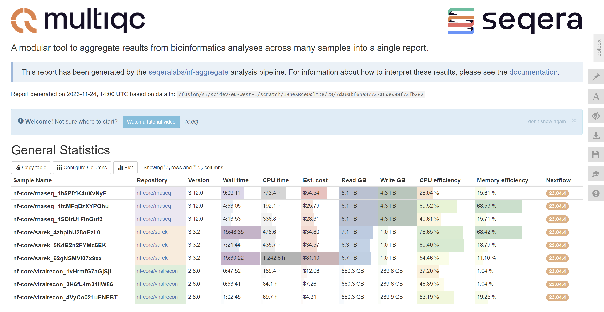

# nf-aggregate

Nextflow pipeline to aggregate pertinent metrics across pipeline runs on the Seqera Platform.

<p align="center">
  
</p>

The pipeline performs the following steps:

1. Downloads run information via the Seqera CLI in parallel
2. Runs MultiQC to aggregate all of the run metrics into a single report

You can download an example MultiQC report [here](assets/multiqc_report.html).

## Prerequisites

- [Nextflow](https://www.nextflow.io/docs/latest/getstarted.html#installation) >=23.10.0
- Account in [Seqera Platform](https://seqera.io/platform/)
- [Access token](https://docs.seqera.io/platform/23.3.0/api/overview#authentication) which is your personal authorization token for the Seqera Platform CLI. This can be created in the user menu under **Your tokens**. Export the token as a shell variable directly into your terminal if running the pipelie locally. You will not need to set this if running the pipeline within the Seqera Platform as it will automatically be inherited from the executing environment.

  ```bash
  export TOWER_ACCESS_TOKEN=<your access token>
  ```

## Usage

The primary input to the pipeline is a file containing a list of run identifiers from the Seqera Platform. These can be obtained from details in the runs page for any pipeline execution. For example, we can create a file called `run_ids.csv` with the following contents:

```
id,workspace
4Bi5xBK6E2Nbhj,community/showcase
4LWT4uaXDaGcDY,community/showcase
38QXz4OfQDpwOV,community/showcase
2lXd1j7OwZVfxh,community/showcase
```

This pipeline can then be executed with the following command:

```
nextflow run seqeralabs/nf-aggregate \
    --input run_ids.csv \
    --outdir ./results \
    -profile docker
```

## Output

The results from the pipeline will be published in the path specified by the `--outdir` and will consist of the following contents:

```
./results
├── multiqc/
│   ├── multiqc_data/
│   ├── multiqc_plots/
│   └── multiqc_report.html                 ## MultiQC report
├── nf-core_rnaseq/
│   ├── gantt/
│   │   └── 4Bi5xBK6E2Nbhj_gantt.html       ## Gantt plot for run
│   └── runs_dump/
│       └── 4Bi5xBK6E2Nbhj/                 ## Output of 'tw runs dump'
│           ├── service-info.json
│           ├── workflow-launch.json
│           ├── workflow-load.json
│           ├── workflow-metrics.json
│           ├── workflow-tasks.json
│           └── workflow.json
└── pipeline_info/
```

### Requirement for Fusion

Note: Gantt plots depend on information derived from Fusion logs. For that reason, Gantt plots will be ommited from outputs for non-Fusion runs, irrespective of the setting of `--skip_run_gantt`. 

## Contributions

Please feel free to create issues and pull requests to this repo if you encounter any problems or would like to suggest/contribute feature enhancements.

## Credits

nf-aggregate was written by the Scientific Development and MultiQC teams at [Seqera Labs](https://seqera.io/).

## Citations

The nf-core pipeline template was used to create the skeleton of this pipeline but there are no plans to contribute it to nf-core at this point.

You can cite the `nf-core` publication as follows:

> **The nf-core framework for community-curated bioinformatics pipelines.**
>
> Philip Ewels, Alexander Peltzer, Sven Fillinger, Harshil Patel, Johannes Alneberg, Andreas Wilm, Maxime Ulysse Garcia, Paolo Di Tommaso & Sven Nahnsen.
>
> _Nat Biotechnol._ 2020 Feb 13. doi: [10.1038/s41587-020-0439-x](https://dx.doi.org/10.1038/s41587-020-0439-x).
